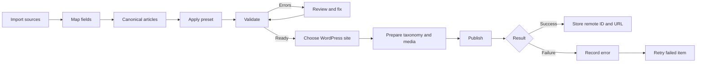

# Business Requirements Document (BRD)

## 1. Purpose
Provide a safe, repeatable desktop workflow for preparing and publishing batches of articles to WordPress sites.

## 2. Business objectives
- Reduce repetitive manual WordPress content operations.
- Standardize destination formatting across batches.
- Reduce wrong-site, broken-image and malformed-HTML publishing errors.
- Make migrations auditable at article level.
- Reuse destination-specific publishing rules.

## 3. Scope

### In scope
- CSV, XLS/XLSX, DOCX and pasted HTML ingestion.
- Source field mapping.
- HTML cleanup and transformation presets.
- Article queue and validation.
- Before/after review.
- Multiple WordPress destinations.
- Category/tag mapping or creation.
- Image acquisition, renaming, upload and URL replacement.
- Featured image selection policy.
- Link replacement rules.
- Draft/publish.
- Batch progress, result log and retry.

### Out of scope
- Automatic semantic rewriting.
- Arbitrary page-builder recreation.
- WordPress server administration.
- Cloud collaboration/account system.

## 4. Stakeholders
- Content/Web Administrator: primary operator.
- Site owner/editor: receives published content.
- Developer/maintainer: configures and extends rules/integrations.

## 5. High-level requirements

| ID | Requirement | Priority |
| --- | --- | --- |
| BRD-001 | Import multiple articles from supported sources | Must |
| BRD-002 | Map heterogeneous source columns to canonical fields | Must |
| BRD-003 | Normalize all articles into a canonical model | Must |
| BRD-004 | Save/reuse destination transformation presets | Must |
| BRD-005 | Show validation problems before publish | Must |
| BRD-006 | Compare source and normalized content | Must |
| BRD-007 | Manage/test multiple WordPress site profiles | Must |
| BRD-008 | Resolve/create categories and tags | Must |
| BRD-009 | Rehost and rename article images | Must |
| BRD-010 | Replace links according to preset rules | Must |
| BRD-011 | Publish one item or selected batch | Must |
| BRD-012 | Track item-level progress/results | Must |
| BRD-013 | Retry failures without duplicating successes | Must |
| BRD-014 | Store WordPress credentials securely | Must |
| BRD-015 | Export/import non-secret presets | Should |
| BRD-016 | Schedule posts | Could |

## 6. Key process

## 7. Business acceptance
The MVP is acceptable when an operator can import a mixed batch, normalize and review it, publish valid articles to an explicitly selected WordPress site and safely identify/retry failures without manually reconstructing the posts in wp-admin.