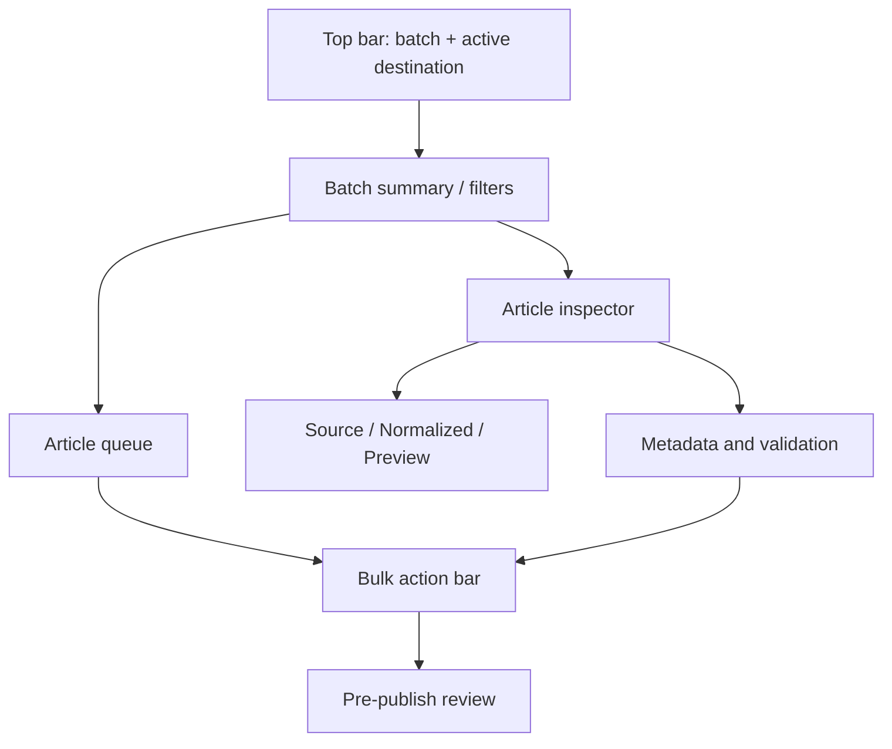

# UX / Information Architecture

## UX goal
The interface is an operations workspace, not a long publishing form. It must make three questions continuously obvious:

1. What is in this batch?
2. Which items need attention?
3. Exactly where and how will selected items be published?

## Primary navigation

### Workspace
Main batch queue and article review.

### Presets
Reusable normalization, image, link and taxonomy rules.

### Sites
WordPress destinations and connection status.

### History
Publish runs, per-item results and remote links.

### Settings
Application-level defaults and security/storage preferences.

## Workspace layout

## Article states
- Imported
- Needs mapping
- Processing
- Needs review
- Ready
- Publishing
- Published
- Failed

State is visible in the queue and filterable. Color is supplemental; state must also use text/icon so meaning does not depend on color.

## Core screens

### 1. Import
Drop files or paste HTML, detect source type, show import result and request field mapping when required.

### 2. Mapping
Map source columns to Title, Content, Slug, Categories, Tags, Status and optional custom fields. Save mapping for repeated source formats.

### 3. Batch workspace
Dense queue on the left; selected article inspector on the right. Supports search, status filter, multi-select and bulk preset/category/tag/status operations.

### 4. Article inspector
Tabs: Normalized, Source, Preview. Metadata and validation remain available without losing queue context.

### 5. Preset editor
Rule groups: HTML, headings, links, images, taxonomy, slug and publishing defaults. Every rule exposes an understandable description and before/after example.

### 6. Site manager
Name, URL, username, credential, connection test, default preset and site capability feedback.

### 7. Pre-publish review
Explicit destination, selected count, publish mode, warnings, blocking errors and media/taxonomy summary. This is the final guard against wrong-site batch publishing.

### 8. Publish progress/results
Per-item progress rather than a single spinner. Success exposes remote URL; failure exposes actionable error and Retry.

## Interaction principles
- Never hide batch failures behind a toast.
- Bulk actions only affect explicit selection.
- Destructive/remote actions are visually distinct from local cleanup.
- Switching articles does not discard edits.
- The active WordPress site remains visible while reviewing/publishing.
- Preview is sanitized and isolated from application privileges.
- Validation uses blocking errors vs non-blocking warnings.

## Empty/error states
Every empty state explains the next action. Errors include affected article, stage, cause when known and safe recovery action.