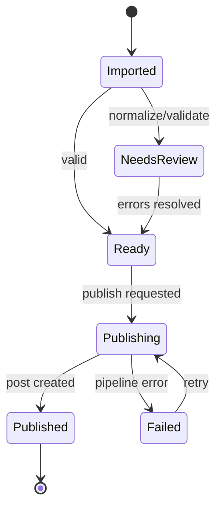

# Software Requirements Specification (SRS)

## 1. System context
Electron desktop application using local application state/storage and the WordPress REST API. The application does not require its own server for MVP.

## 2. Canonical Article model

```ts
interface Article {
  id: string;
  source: SourceDescriptor;
  original: ArticleSnapshot;
  normalized: ArticleSnapshot;
  validation: ValidationResult[];
  state: ArticleState;
  publish?: PublishResult;
}

interface ArticleSnapshot {
  title: string;
  slug: string;
  html: string;
  categories: string[];
  tags: string[];
  status: 'draft' | 'publish' | 'pending' | 'private' | 'future';
  images: ArticleImage[];
}
```

## 3. Functional requirements

### Import
- FR-001 Import one or many CSV files.
- FR-002 Import XLS/XLSX workbook data and select sheet when multiple sheets exist.
- FR-003 Import DOCX; one file may produce one article in MVP.
- FR-004 Paste HTML and title manually.
- FR-005 Detect missing required mappings.
- FR-006 Allow column mapping and mapping reuse.
- FR-007 Preserve original imported snapshot.

### Normalization
- FR-020 Sanitize unsafe elements/attributes using allow-list policy.
- FR-021 Apply configurable remove/replace element rules.
- FR-022 Apply heading transformation rules.
- FR-023 Generate/normalize slug.
- FR-024 Apply link replacement rules.
- FR-025 Discover images without mutating remote content during preview.
- FR-026 Apply image filename policy.
- FR-027 Apply taxonomy/default-status preset rules.
- FR-028 Re-running a deterministic preset on unchanged source/config yields equivalent normalized output.

### Validation
- FR-040 Validate required title/content/destination.
- FR-041 Validate slug and duplicate-in-batch conditions.
- FR-042 Detect unresolved/unsupported image sources.
- FR-043 Detect disallowed HTML remaining after normalization.
- FR-044 Distinguish Error and Warning severities.
- FR-045 Prevent publish when blocking validation errors exist.

### Site profiles
- FR-060 Create/edit/delete local WordPress profiles.
- FR-061 Store URL and username separately from protected credential.
- FR-062 Test `/wp-json/wp/v2/users/me?context=edit` connectivity/authentication.
- FR-063 Never write Application Password to logs/exported presets.

### WordPress preparation
- FR-080 Search destination categories/tags.
- FR-081 Create missing taxonomy terms when policy permits.
- FR-082 Download/decode article images.
- FR-083 Rename image according to active preset.
- FR-084 Upload media and retain returned media ID/source URL.
- FR-085 Replace image source URLs in final post content.
- FR-086 Set alt text according to configured policy.
- FR-087 Optionally assign first/specified image as featured media.

### Publishing
- FR-100 Publish one or multiple selected articles.
- FR-101 Show destination and item count before batch mutation.
- FR-102 Track pipeline state per article.
- FR-103 Store remote post ID, URL and status on success.
- FR-104 Store structured stage/error on failure.
- FR-105 Retry failed items without including successful items by default.
- FR-106 Support draft and publish at minimum.

## 4. Non-functional requirements

### Security
- NFR-001 Renderer uses context isolation; no direct Node integration.
- NFR-002 Secrets use OS-protected storage where supported.
- NFR-003 Preview content must not execute scripts or obtain Electron privileges.
- NFR-004 HTTPS is required/recommended for authenticated production destinations; insecure endpoints require explicit warning/block policy.

### Reliability
- NFR-010 One article failure must not corrupt the batch state.
- NFR-011 Network requests have timeouts and structured errors.
- NFR-012 Successful remote IDs are retained before subsequent batch work proceeds.
- NFR-013 Remote mutations are not automatically repeated after ambiguous network failure without duplicate-safety handling.

### Performance
- NFR-020 UI remains responsive for a target batch of 500 text articles excluding very large media payloads.
- NFR-021 Import/normalization work that can block rendering runs outside expensive synchronous renderer loops.
- NFR-022 Publish concurrency is bounded/configurable to avoid overwhelming WordPress hosts.

### Usability
- NFR-030 Validation and publish state are visible at article and batch level.
- NFR-031 No remote mutation occurs merely by previewing/applying local normalization rules.

## 5. Publishing state machine



## 6. WordPress pipeline
For each article: validate -> resolve taxonomy -> prepare/upload media -> rewrite final HTML -> create/update post -> persist result. The implementation must identify the stage of any failure.

## 7. Data persistence
MVP stores application configuration locally. A later implementation decision will select the persistence mechanism for working batches/history (JSON/SQLite). Credentials are separated from portable project/preset data.

## 8. Testability
Each importer, normalizer rule, validator, filename strategy, taxonomy resolver and payload builder should expose pure/testable boundaries where possible. WordPress HTTP calls must be mockable for automated tests.