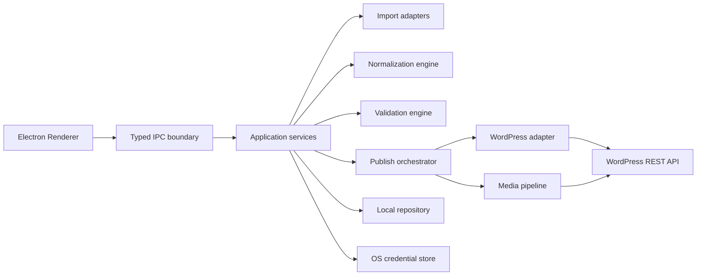

# Architecture

## Target architecture



## Layers

### Renderer
Queue, editor, diff/preview, presets, sites, history and progress. No WordPress credentials or unrestricted Node APIs are exposed directly.

### IPC/API boundary
Explicit commands and DTOs. Validate inputs before invoking application services.

### Domain
Canonical Article, Preset, SiteProfile, ValidationResult, PublishJob and PublishResult models. No Electron or HTTP dependency.

### Application services
ImportBatch, NormalizeBatch, ValidateBatch, TestSiteConnection, PublishBatch and RetryFailed operations.

### Infrastructure
CSV/XLSX/DOCX adapters, WordPress REST client, filesystem/network media fetcher, local persistence and protected credential implementation.

## Publish orchestration
Remote operations are staged so errors are attributable:
1. preflight validation
2. taxonomy resolution
3. media acquisition
4. media upload
5. content URL rewrite
6. post mutation
7. local result persistence

Concurrency must be bounded. Item jobs are independent and expose progress events to the renderer.

## Duplicate safety
A successful post stores destination site ID + remote post ID. Retry defaults to failed jobs only. Ambiguous timeouts during post creation require reconciliation before blindly issuing another create request.

## Security boundaries
- `contextIsolation: true`
- `nodeIntegration: false`
- Narrow preload API
- Sanitize source HTML before application preview
- Never interpolate untrusted HTML into privileged application contexts
- Redact Authorization/password values from logs
- OS-protected credential storage where available

## Proposed source layout

```text
src/
  main/
    ipc/
    services/
    infrastructure/
  renderer/
    screens/
    components/
    state/
  domain/
    models/
    rules/
    validation/
  shared/
    contracts/
tests/
  unit/
  integration/
  fixtures/
```

The first generated MVP is treated as a proof of capability; implementation should be refactored toward these boundaries before feature expansion.